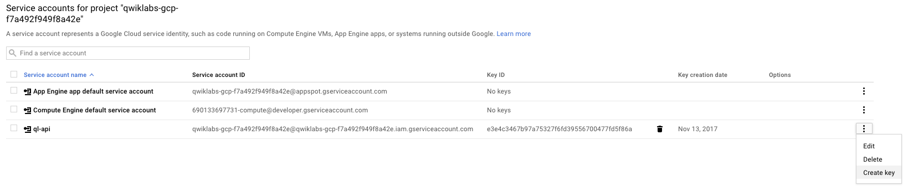
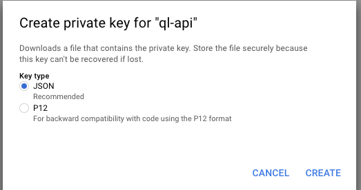

# gcp
google cloud platform with terraform

## terrafrom download
https://www.terraform.io/downloads.html

## google cloud platform
https://console.cloud.google.com

## provider settings
~~~~
provider "google" {
  credentials = "${file("account.json")}"
  project     = "qwiklabs-gcp-7d4e3870a9b5944c"
  region      = "ap-northeast-1"
}
~~~~
- credentials is provided from `APIs & services` -> `Credentials` -> `Service account keys`
- 
- download a json file.
- 

example.json
```json
{
  "type": "service_account",
  "project_id": "qwiklabs-gcp-4af5ff53d5c03267",
  "private_key_id": "-",
  "private_key": "-",
  "client_email": "qwiklabs-gcp-4af5ff53d5c03267@qwiklabs-gcp-4af5ff53d5c03267.iam.gserviceaccount.com",
  "client_id": "112069848741845590226",
  "auth_uri": "https://accounts.google.com/o/oauth2/auth",
  "token_uri": "https://accounts.google.com/o/oauth2/token",
  "auth_provider_x509_cert_url": "https://www.googleapis.com/oauth2/v1/certs",
  "client_x509_cert_url": "-"
}
```

## Create a VPC
```terraform
resource "google_compute_network" "default" {
  name                    = "learnauto"
  description             = "Learn about auto-type networks"
  auto_create_subnetworks = "true"
}
```
- if you want to config custom subnet, the value of `auto_create_subnetworks=true`

## Create a subnet
```terraform
resource "google_compute_subnetwork" "subnet1a" {
  name   = "subnet-1a"
  ip_cidr_range = "192.168.5.0/24"
  network = "${google_compute_network.default.self_link}"
  region = "us-east1"
}
```

## Create a vm
boot_disk list : https://cloud.google.com/compute/docs/images
machine_type : https://cloud.google.com/compute/docs/reference/latest/instances#machineType
```terraform
resource "google_compute_instance" "vm1" {
  name         = "learn-1"
  machine_type = "f1-micro" # "n1-standard-1",custom : "custom-CPUs-MEMORY", example :  "custom-2-2048" 
  zone         = "us-east1-b"

  tags = ["foo", "bar"]

  boot_disk {
    initialize_params {
      image = "debian-cloud/debian-9"
    }
  }

  // Local SSD disk
  /*
  scratch_disk {
  }
  */

  network_interface {
    network = "default"
    //network      = "${google_compute_network.custom-subnet.id}"
    //subnetwork   = "${google_compute_subnetwork.subnet1a.id}"

    access_config {
      // Ephemeral IP
    }
  }


  metadata {
    foo = "bar"
  }

  metadata_startup_script = "sudo apt-get install traceroute"
/*
  service_account {
    scopes = ["userinfo-email", "compute-ro", "storage-ro"]
  }
  */
}
```

you can check the status of VM
~~~~
Enter the following command: 
`free`

To see details about the RAM installed in your VM, enter the following command:
`sudo dmidecode -t 17`

Enter the following command to verify the number of processors:
`nproc`

To see details about the CPUs installed in your VM, enter the following command:
`lscpu`

Exit the terminal
`exit`
~~~~
